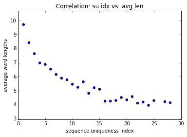

# Analysis of the Indonesian dictionary

## By Kieran Roberts

The data
========
The data is a dictionary data/IndoWordList.dic file containing just over 40,000
Bahasa words

Load the data
-------------
The file contains words with white space (e.g. _Africa Selatan_) and white space
will be treated as a seperator between words. Existing words will not be
duplicated.

    words = []
    with open('data/IndoWordList.dic', 'r') as file:
        for w in file:
            w = w.strip().lower()
            ws = w.split()
            for v in ws:
                # Don't add repeated words
                if v in words:
                    continue
                else:
                    words.append(v)

    

Lets compute the number of words and list the first 10

    print 'There are', len(words), 'words and the first 10 words are:\n' 
    print words[0:10]

    There are 40942 words and the first 10 words are:
    
    ['abri', 'aceh', 'achenese', 'ad', 'afganistan', 'africa', 'selatan', 'afrika', 'agustus', 'akpol']

Cleaning the data
-----------------
There are many "non-words" in this list that need to be either removed or
modified. This is done in the following order:
1. Delete all words that contain no vowels.
2. Delete all words which have size >=2 and only consists of vowels.
3. Remove two words which have accented letters. These are not bahasa words.
4. Remove or modify the words containing the character '.
5. Remove abbreviations and acronyms, i.e. words containing periods.

    import utils
    words = [ w for w in words if len(utils.getVowels(w)) > 0 ]
    words = [ w for w in words if  len(utils.getConsonants(w)) > 0 or len(w) == 1 ]
    words = [ w for w in words if '\xe9' not in w ]
    words = [ w for w in words if  ('\'t' and '\'s' and 's\'') not in w ]; words = [ w.replace('\'', '') for w in words ]
    words = [ w for w in words if '.' not in w]
    words = list(set(words))

We might have duplicated words from step 4. Lets remove them and count the
number of words.

    words = list(set(words))
    print 'There are ', len(words), 'words.'

    There are  40753 words.

Creating a data frame for the words
===================================
This will be a pandas.DataFrame where each row corresponds to a word and some
interesting properties for this analysis.

The columns
-----------
1. the word (str),
2. length of word (int),
3. consonant sequence (str), e.g. 'afrika' has consonant sequence 'afrk'
4. (consonant) sequence uniqueness index, i.e. a consonant sequence _seq_ has
index _i_ if there have _i_ words with consonant sequence equal to _seq_
5. has alternating pattern, i.e. vcvcvc... or cvcvc... (int bool), e.g. penapis
6. has vowel-separating pattern, e.g. vcccvcvccvc... or cvccvcvcccvc... (int
bool), e.g. diperdagangkan

    wordLengths = []
    for word in words:
        wordLengths.append(utils.wordLength(word))
    
    
    consonantSeq = [ utils.getConsonantSeq(s) for s in words ]
    
    consonantSeqDict = dict()
    for s in consonantSeq:
        if s in consonantSeqDict.keys():
            consonantSeqDict[s] += 1
        else:
            consonantSeqDict[s] = 1
    
    uniquenessSeq = [ consonantSeqDict[s] for s in consonantSeq ]  
    
    altPat = []
    for w in words:
        if '-' in w:
            flag = True
            ws = w.split('-')
            for i in range(0,len(ws)):
                if not(utils.hasAltPattern(ws[i])):
                    flag = False
                    altPat.append(0)
                    break
            if flag:
                altPat.append(1)
        else:
            altPat.append(int(utils.hasAltPattern(w)))
    
    vowSep = []
    for w in words:
        if '-' in w:
            flag = True
            ws = w.split('-')
            for i in range(0,len(ws)):
                if not(utils.hasVowelSepPattern(ws[i])):
                    flag = False
                    vowSep.append(0)
                    break
            if flag:
                vowSep.append(1)
        else:
            vowSep.append(int(utils.hasVowelSepPattern(w)))

Finally bring it together as a pandas.DataFrame and re-arrange the columns.

    import pandas
    df = pandas.DataFrame({
        'word' : words,
        'length' : wordLengths,
        'consonant.seq' : consonantSeq,
        'alt.pattern' : altPat,
        'vow.sep.pattern' : vowSep,
        'seq.uniqueness.idx' : uniquenessSeq 
        })
    df = df[['word', 'length', 'consonant.seq', 'seq.uniqueness.idx', 'alt.pattern', 'vow.sep.pattern']]

    

Lets take a look at the first 15 entries.

    df.head(15)

<table border="1" class="dataframe">
  <thead>
    <tr style="text-align: right;">
      <th></th>
      <th>word</th>
      <th>length</th>
      <th>consonant.seq</th>
      <th>seq.uniqueness.idx</th>
      <th>alt.pattern</th>
      <th>vow.sep.pattern</th>
    </tr>
  </thead>
  <tbody>
    <tr>
      <th>0 </th>
      <td>       berpenumpang</td>
      <td> 12</td>
      <td>   brpnmpng</td>
      <td> 1</td>
      <td> 0</td>
      <td> 1</td>
    </tr>
    <tr>
      <th>1 </th>
      <td>             gabung</td>
      <td>  6</td>
      <td>       gbng</td>
      <td> 3</td>
      <td> 0</td>
      <td> 1</td>
    </tr>
    <tr>
      <th>2 </th>
      <td>            jaluran</td>
      <td>  7</td>
      <td>       jlrn</td>
      <td> 2</td>
      <td> 1</td>
      <td> 1</td>
    </tr>
    <tr>
      <th>3 </th>
      <td> disfungsionalisasi</td>
      <td> 18</td>
      <td> dsfngsnlss</td>
      <td> 1</td>
      <td> 0</td>
      <td> 0</td>
    </tr>
    <tr>
      <th>4 </th>
      <td>             murung</td>
      <td>  6</td>
      <td>       mrng</td>
      <td> 7</td>
      <td> 0</td>
      <td> 1</td>
    </tr>
    <tr>
      <th>5 </th>
      <td>          kepepalan</td>
      <td>  9</td>
      <td>      kppln</td>
      <td> 1</td>
      <td> 1</td>
      <td> 1</td>
    </tr>
    <tr>
      <th>6 </th>
      <td>         terkencing</td>
      <td> 10</td>
      <td>    trkncng</td>
      <td> 2</td>
      <td> 0</td>
      <td> 1</td>
    </tr>
    <tr>
      <th>7 </th>
      <td>          melompong</td>
      <td>  9</td>
      <td>     mlmpng</td>
      <td> 3</td>
      <td> 0</td>
      <td> 1</td>
    </tr>
    <tr>
      <th>8 </th>
      <td>             godaan</td>
      <td>  6</td>
      <td>        gdn</td>
      <td> 3</td>
      <td> 0</td>
      <td> 0</td>
    </tr>
    <tr>
      <th>9 </th>
      <td>       mengerudungi</td>
      <td> 12</td>
      <td>    mngrdng</td>
      <td> 2</td>
      <td> 0</td>
      <td> 1</td>
    </tr>
    <tr>
      <th>10</th>
      <td>            penapis</td>
      <td>  7</td>
      <td>       pnps</td>
      <td> 2</td>
      <td> 1</td>
      <td> 1</td>
    </tr>
    <tr>
      <th>11</th>
      <td>      menggerayangi</td>
      <td> 13</td>
      <td>   mnggryng</td>
      <td> 2</td>
      <td> 0</td>
      <td> 1</td>
    </tr>
    <tr>
      <th>12</th>
      <td>           bergulir</td>
      <td>  8</td>
      <td>      brglr</td>
      <td> 4</td>
      <td> 0</td>
      <td> 1</td>
    </tr>
    <tr>
      <th>13</th>
      <td>             jamiah</td>
      <td>  6</td>
      <td>        jmh</td>
      <td> 5</td>
      <td> 0</td>
      <td> 0</td>
    </tr>
    <tr>
      <th>14</th>
      <td>            sambung</td>
      <td>  7</td>
      <td>      smbng</td>
      <td> 6</td>
      <td> 0</td>
      <td> 1</td>
    </tr>
  </tbody>
</table>

15 rows × 6 columns

Analysis
========
Distribution of word lengths
----------------------------
It would be interesting to know some basic statistics about list of words. Lets
compute the maximum, minimum, median, mean, standard deviation and mode of the
lengths of words and the corresponding distribution.

    print 'max = ', df['length'].max(),',',
    print 'min = ', df['length'].min(),',',
    print 'median = ', df['length'].median(),',',
    print 'mean = ', df['length'].mean(),',',
    print 'mode = ', list(df['length'].mode())[0],',',
    print 'std = ', df['length'].std()

    max =  25 , min =  1 , median =  8.0 , mean =  8.3884621991 , mode =  8 , std =  2.67787532707

    %matplotlib inline
    import matplotlib.pyplot as plt
    
    ax = df['length'].hist(color='red', bins = 25)
    ax.set_title('Frequency of word lengths in the Indonesian language')
    ax.set_ylabel('Frequency')
    ax.set_xlabel('Word lengths')
    ax.axvline(8, color='blue', linestyle='--')
    ax.text(8.5,6600, s = 'median = 8', color='blue')
    ax

    <matplotlib.axes.AxesSubplot at 0x7efc6bd8d450>

The word lengths have a normal distribution shape with positive skewness.

    import numpy
    from scipy.stats import norm  
    
    %matplotlib inline
    df['length'].hist(color='red', bins=25, normed=True)
    rng = numpy.arange(0, 25, 0.001)
    plt.plot(rng, norm.pdf(rng,df['length'].mean(),df['length'].std()), linewidth=3.0)
    plt.title('Normalised histogram with fitted normal curve')
    plt.xlim(0,30)
    plt.xlabel('Word lengths')
    plt.ylabel('Normalised frequency')

    <matplotlib.text.Text at 0x7efc64f8ed50>

Syllable analysis
-----------------
One of the reasons we are interested in the so-called _alternating_ and _vowel-
separating_ patterns is because they provide a strong relationship between the
number syllables and the number of vowels in a given word.

In particular, if a word **w** has an alternating or vowel-seperating pattern
(i.e. _alt.pattern_ == 1 and _vow.sep.pattern_ == 1), then the number of
syllables **w** is equal to the number of vowels in **w**.

What ratio of words in the dictionary exhibit the alternating and/or vowel-
separating patterns? Note that if a word has the alternating pattern, then it
necessarily has the vowel-separating pattern (the former is a special case of
the latter).

    print 'ratio of alternating words = ', df['alt.pattern'].mean() 
    print 'ratio of vowel-separating words = ', df['vow.sep.pattern'].mean() 

- **26%** of all words have the alternating pattern, i.e. vcvcv... or cvcv...
for vowels v and consonants c.
- **84%** of all words have the more generalised vowel-separating pattern, i.e.
cvcccvccvc... for vowels v and consonants c.

In particular, the vast majority of indonesian words have the same number of
syllables as vowels.

Abbreviation and Internet slang
-------------------------------
It is common for native speakers of Bahasa to abbreviate many words to 2, 3 or
4. For example _km_ for _kamu_, _ngpn_ for _ngapain_, and _gmn_ for  _gimana_.
In all these cases, the word has been reduced to its consonant sequence. There
are of course many words whose abbreaviations are not their consonant sequences,
for example _skg_ for _sekarang_ and this study will not deal with those.

For non-native speakers and beginners it can be difficult to know the precise
word being used without understanding the context. The (consonant) sequence
uniqueness index (seq.uniqueness.idx) indicates how difficult it may be to
recover the full word with its vowels. The lower seq.uniqueness.idx, the easier
it is to guess the true spelling of the word (seq.uniqueness.idx implies that an
abbreviation represents a unique word).

Lets first compute how many consonant sequences represent a unique word and take
a sample of such sequences.

    print ' # consonant sequences representing unique words = ', len(df[df['seq.uniqueness.idx']==1])
    df[df['seq.uniqueness.idx']==1].head(10)

     # consonant sequences representing unique words =  19304

<table border="1" class="dataframe">
  <thead>
    <tr style="text-align: right;">
      <th></th>
      <th>word</th>
      <th>length</th>
      <th>consonant.seq</th>
      <th>seq.uniqueness.idx</th>
      <th>alt.pattern</th>
      <th>vow.sep.pattern</th>
    </tr>
  </thead>
  <tbody>
    <tr>
      <th>0 </th>
      <td>       berpenumpang</td>
      <td> 12</td>
      <td>   brpnmpng</td>
      <td> 1</td>
      <td> 0</td>
      <td> 1</td>
    </tr>
    <tr>
      <th>3 </th>
      <td> disfungsionalisasi</td>
      <td> 18</td>
      <td> dsfngsnlss</td>
      <td> 1</td>
      <td> 0</td>
      <td> 0</td>
    </tr>
    <tr>
      <th>5 </th>
      <td>          kepepalan</td>
      <td>  9</td>
      <td>      kppln</td>
      <td> 1</td>
      <td> 1</td>
      <td> 1</td>
    </tr>
    <tr>
      <th>15</th>
      <td>         berstandar</td>
      <td> 10</td>
      <td>    brstndr</td>
      <td> 1</td>
      <td> 0</td>
      <td> 1</td>
    </tr>
    <tr>
      <th>16</th>
      <td>           pemasang</td>
      <td>  8</td>
      <td>      pmsng</td>
      <td> 1</td>
      <td> 0</td>
      <td> 1</td>
    </tr>
    <tr>
      <th>17</th>
      <td>         sepertujuh</td>
      <td> 10</td>
      <td>     sprtjh</td>
      <td> 1</td>
      <td> 0</td>
      <td> 1</td>
    </tr>
    <tr>
      <th>19</th>
      <td>         berswadaya</td>
      <td> 10</td>
      <td>     brswdy</td>
      <td> 1</td>
      <td> 0</td>
      <td> 1</td>
    </tr>
    <tr>
      <th>20</th>
      <td>     diperdagangkan</td>
      <td> 14</td>
      <td>  dprdgngkn</td>
      <td> 1</td>
      <td> 0</td>
      <td> 1</td>
    </tr>
    <tr>
      <th>21</th>
      <td>           misahkan</td>
      <td>  8</td>
      <td>      mshkn</td>
      <td> 1</td>
      <td> 0</td>
      <td> 1</td>
    </tr>
    <tr>
      <th>23</th>
      <td>     waalaikumsalam</td>
      <td> 14</td>
      <td>    wlkmslm</td>
      <td> 1</td>
      <td> 0</td>
      <td> 0</td>
    </tr>
  </tbody>
</table>

10 rows × 6 columns

Correlations between variables
------------------------------
Question:
Investigate the correlation between seq.uniqueness.idx and
      1. average ratio of words that satsify the vow.sep.pattern
      2. average legnth of words

Lets begin by creating the appropriate data frame. Group the original
pandas.DataFrame df by seq.uniqueness.idx.
For each such index 1<=i<=28, compute
      - The ratio # words (seq.uniqueness.idx == i and vow.sep.patter == 1) : #
words with (seq.uniqueness.idx == i) := avg.len
      - The average length of a word with ( seq.uniqueness.idx == i ) =:
avg.ratio'

Call the new dataframe df2 and give it column names
    1. Sequence uniqueness index (su.idx)
    2. avg.ratio
    3. avg.len

    df2 = pandas.DataFrame({
    	'avg.ratio' : df.groupby( ['seq.uniqueness.idx'] ).mean()['vow.sep.pattern'],
    	'avg.length' : df.groupby( ['seq.uniqueness.idx'] ).mean()['length'] 
    }).reset_index()
    df2.columns = ['su.idx', 'avg.len', 'avg.ratio' ]
    df2 = df2[['su.idx', 'avg.ratio', 'avg.len']]

Lets look at the first 10 entries.

    df2.head(10)

<table border="1" class="dataframe">
  <thead>
    <tr style="text-align: right;">
      <th></th>
      <th>su.idx</th>
      <th>avg.ratio</th>
      <th>avg.len</th>
    </tr>
  </thead>
  <tbody>
    <tr>
      <th>0</th>
      <td>  1</td>
      <td> 0.849358</td>
      <td> 9.722648</td>
    </tr>
    <tr>
      <th>1</th>
      <td>  2</td>
      <td> 0.861595</td>
      <td> 8.421884</td>
    </tr>
    <tr>
      <th>2</th>
      <td>  3</td>
      <td> 0.844444</td>
      <td> 7.645767</td>
    </tr>
    <tr>
      <th>3</th>
      <td>  4</td>
      <td> 0.835938</td>
      <td> 6.981771</td>
    </tr>
    <tr>
      <th>4</th>
      <td>  5</td>
      <td> 0.820779</td>
      <td> 6.879221</td>
    </tr>
    <tr>
      <th>5</th>
      <td>  6</td>
      <td> 0.802439</td>
      <td> 6.540650</td>
    </tr>
    <tr>
      <th>6</th>
      <td>  7</td>
      <td> 0.795918</td>
      <td> 6.165414</td>
    </tr>
    <tr>
      <th>7</th>
      <td>  8</td>
      <td> 0.828125</td>
      <td> 5.897569</td>
    </tr>
    <tr>
      <th>8</th>
      <td>  9</td>
      <td> 0.775681</td>
      <td> 5.781971</td>
    </tr>
    <tr>
      <th>9</th>
      <td> 10</td>
      <td> 0.764815</td>
      <td> 5.461111</td>
    </tr>
  </tbody>
</table>

10 rows × 3 columns

#### Sequence uniqueness index vs. average length

One would expect the larger the word, the lower the sequence uniqueness since
the consonant seqeunce would be less common. We can observer this from the
scatter plot.

    %matplotlib inline
    
    plt.scatter(df2['su.idx'], df2['avg.len'])
    plt.title('Correlation: su.idx vs. avg.len')
    plt.xlabel('sequence uniqueness index')
    plt.ylabel('average word lengths')
    plt.xlim(0, df2['su.idx'].max() + 2)
    plt.ylim(df2['avg.len'].min()-1, df2['avg.len'].max() + 1)

    (2.9583333333333335, 10.722648155822627)

    

Now create a linear model out of the data (i.e. fit a straight line to the
points)

    %matplotlib inline
    
    plt.scatter(df2['su.idx'], df2['avg.len'], color='red')
    plt.title('Correlation: su.idx vs. avg.len')
    plt.xlabel('sequence uniqueness index')
    plt.ylabel('average word lengths')
    plt.xlim(0, df2['su.idx'].max() + 2)
    plt.ylim(df2['avg.len'].min()-1, df2['avg.len'].max() + 1)
    
    m, b = numpy.polyfit(df2['su.idx'], df2['avg.len'],1)
    plt.plot(df2['su.idx'], m*df2['su.idx'] + b, '-', color='blue')

    [<matplotlib.lines.Line2D at 0x7efc64e82d50>]

    One can see that there are many outliers at both ends of the sequence uniqueness ind

#### Sequence uniqueness index vs. average ratio of vowel-separated words

Lets explore the data by plotting a scatter diagram.

    %matplotlib inline
    
    plt.scatter(df2['su.idx'], df2['avg.ratio'])
    plt.title('Correlation: su.idx vs. avg.ratio')
    plt.xlabel('sequence uniqueness index')
    plt.ylabel('average ratio of vowel-separated words')
    plt.xlim(0, df2['su.idx'].max() + 2)
    plt.ylim(0.45, 1)
    plt.show()

It appears there is a linear relationship (large negative correlation). Lets fit
a linear model to it as before.

    %matplotlib inline
    
    plt.scatter(df2['su.idx'], df2['avg.ratio'], color='red')
    plt.title('Correlation: su.idx vs. avg.ratio')
    plt.xlabel('sequence uniqueness index')
    plt.ylabel('average ratio of vowel-separated word')
    plt.xlim(0, df2['su.idx'].max() + 2)
    plt.ylim(0.45, 1)
    
    m, b = numpy.polyfit(df2['su.idx'], df2['avg.ratio'],1)
    plt.plot(df2['su.idx'], m*df2['su.idx'] + b, '-')

    [<matplotlib.lines.Line2D at 0x7efc64d6b790>]

This looks like a very good fit with only two outliers. Lets annotate the plot
to highlight the outliers.

    %matplotlib inline
    
    plt.scatter(df2['su.idx'], df2['avg.ratio'], color='red')
    plt.title('Correlation: su.idx vs. avg.ratio')
    plt.xlabel('sequence uniqueness index')
    plt.ylabel('average ratio of vowel-separated word')
    plt.xlim(0, df2['su.idx'].max() + 2)
    plt.ylim(0.45, 1)
    
    m, b = numpy.polyfit(df2['su.idx'], df2['avg.ratio'],1)
    plt.plot(df2['su.idx'], m*df2['su.idx'] + b, '-')
    plt.annotate('outlier', xy=(24, 0.791667), xytext=(25.5, 0.83),
                arrowprops=dict(arrowstyle="->",connectionstyle="arc3"))
    plt.annotate('outlier', xy=(25,0.500000), xytext=(26.5, 0.47),
                arrowprops=dict(arrowstyle="->",connectionstyle="arc3")) 

    <matplotlib.text.Annotation at 0x7efc64bc1750>

